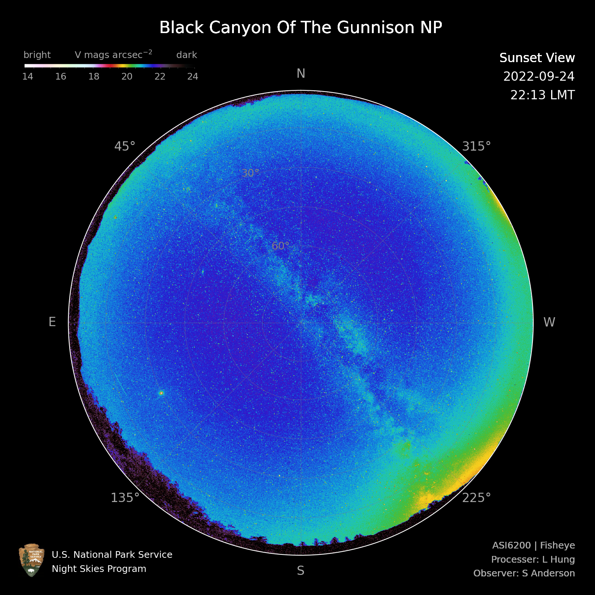

# Fisheye Night Sky Imager Data Processing Pipeline

*Developed and maintained by [Li-Wei Hung](https://github.com/liweihung). For questions, please open a [GitHub issue](https://github.com/liweihung/Fisheye/issues).*

---

## Background

The NPS Fisheye Night Sky Imager is a camera system developed by the Night Skies Team of the U.S. National Park Service to measure and monitor night sky brightness in national parks. It comprises a Sony IMX455 CMOS sensor housed in a ZWO ASI6200MM camera, a Johnson V filter, and a Sigma 8 mm F3.5 fisheye lens — all commercially acquired components. The fisheye lens captures the entire sky in a single 30-second exposure. This open-source pipeline processes the resulting images through flat-field correction, astrometric plate solving, photometric calibration using Hipparcos standard stars, positional calibration, median filtering, and final projection in both fisheye and Hammer equal-area views, with a photometric calibration uncertainty of 0.12 mag.

---

## Example Output

<p align="center">
  
</p>

---

## Citation

If you use this pipeline in your work, please cite:

> Hung, L.-W., White, J., Joyce, D., Anderson, S. J., & Banet, B. (2024). Fisheye Night Sky Imager: A Calibrated Tool to Measure Night Sky Brightness. *Publications of the Astronomical Society of the Pacific*, 136, 085002. https://doi.org/10.1088/1538-3873/ad6bc1

```bibtex
@article{Hung2024,
  author  = {Hung, Li-Wei and White, Jeremy and Joyce, Damon and Anderson, Sharolyn J. and Banet, Benjamin},
  title   = {Fisheye Night Sky Imager: A Calibrated Tool to Measure Night Sky Brightness},
  journal = {Publications of the Astronomical Society of the Pacific},
  volume  = {136},
  pages   = {085002},
  year    = {2024},
  doi     = {10.1088/1538-3873/ad6bc1}
}
```

---

## Dependencies

- Python 3.12.12
- Git
- [Astrometry.net](http://nova.astrometry.net/) account and API key

> ⚠️ Never commit your Astrometry.net API key to the repository.

---

## Getting Started

Clone the repository:

```bash
git clone https://github.com/liweihung/Fisheye.git
```

Set up and activate the conda environment:

```bash
cd Fisheye/Scripts
conda create --name fisheye python=3.12.12
conda activate fisheye
pip install poetry
poetry install
```

### Contributing
Pull requests are welcome. See GitHub's [Contributing to a project](https://docs.github.com/en/get-started/exploring-projects-on-github/contributing-to-a-project) guide for details.

---

## Project Structure

```
Fisheye/
├── Calibration/        # Calibration files
├── Data_raw/           # Raw input images
├── Data_processed/     # Processed output images
└── Scripts/            # Processing scripts
```

---

## Running the Pipeline

This assumes you have a full set of calibration files which are not provided here.

### Activate the fisheye environment
```bash
cd Fisheye/Scripts
conda activate fisheye
```

Before each session, pull the latest changes:
```bash
git pull
```

### Step 1 — Generate the fisheye mask
Edit `mask_input.py` with your camera name, then run:

```bash
python mask.py
```

### Step 2 — Process all images
Edit `process_input.py` with your deployment metadata and your Astrometry.net API key, then run:

```bash
python process.py
```

| Script | Description |
|---|---|
| `reduction.py` | Reduces raw images using flat, dark, bias, linearity curve, and mask |
| `astrometry.py` / `client.py` | Detects stars and solves astrometry via Astrometry.net |
| `photometry.py` | Measures zeropoint and extinction using Hipparcos standard stars |
| `photometric_calibration.py` | Converts image from ADU/s to mag/arcsec² |
| `positional_calibration.py` | Rotates image to have north pointing up |
| `median_filter.py` | Removes point sources to reveal sky background |
| `projection.py` | Generates fisheye and Hammer equal-area projections |

---

### Pipeline Overview

```
mask.py
    └── mask_input.py → fisheye mask

reduction.py
    └── process_input.py + raw images + flat + linearity curve + mask
        → reduced images

astrometry.py
    └── reference image + mask
        → center.txt + detected_stars.csv

photometry.py
    └── Hipparcos standards + reference image + detected_stars.csv + latitude and longitude
        → zeropoint.csv + zeropoint.png

photometric_calibration.py
    └── zeropoint.csv + platescale.csv + reduced images
        → photometrically calibrated images + detected_stars.csv

positional_calibration.py
    └── center.txt + observing time + mask + photometrically calibrated images
        → positionally corrected images

median_filter.py
    └── platescale.csv + positionally corrected images
        → median-filtered images

projection.py
    └── mask + all calibrated images → fisheye.png & hammer.png
```

---

## License

This project is in the public domain within the United States, and copyright and related rights in the work worldwide are waived through the [CC0 1.0 Universal public domain dedication](https://creativecommons.org/publicdomain/zero/1.0/).

All contributions to this project will be released under the CC0 dedication. By submitting a pull request, you are agreeing to comply with this waiver of copyright interest.

---

*Last updated: June 2026*
